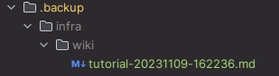

---
metadata:
  title: WikiCTL
  description: Easy to use API for WikiJS
  path: infra/wiki/tutorial
  tags:
  - tag: infra
---

# WikiJS CLI
Pour ceux qui comme moi on l'habitude de faire trainer des notes en markdown un peu partout sur leur PC, qui gitent le 
tout et ont la flemme de reporter ce qui est intéressant sur le Wiki, je vous ai concoté un petit script qui vous permet
de partager vos chef d'oeuvres en une commande !

Peut importe où vous vous trouvez, rajoutez un petit entete à votre fichier pour indiquer le titre, le chemin sur le 
wiki, etc... Puis utilisez `wikictl` pour envoyer votre fichier sur le wiki.

Il faut évidemment avoir une clef API et la renseigner dans un fichier de configuration.

## Installation
Création de l'environnement virtuel avec l'installation des modules :
```sh
python3 -m venv venv
source venv/bin/activate
pip install -r requirements.txt
```

## Configuration
Créez le fichier de configuration `config.json` et mettez-le à la racine du projet (ou alors modifiez le code..). La
structure est la suivante : 
```json 
{ 
  "api_key": "<VOTRE_CLEF>",
  "api_url": "https://wiki.hackademint.org/graphql"
}
```
## Méta données
Il faut indiquer dans chaque fichier les données nécessaire à sa création sur le wiki. Les informations obligatoires 
sont : le titre, la description, le chemin et les tags. C'est aussi les seules méta données supportées pour l'instant
par mon script. 
```yaml
---
metadata:
  title: Test
  description: This is a test
  path: tests/python
  tags:
  - tag: infra
---
```

> N'oubliez pas de rajouter les `---` autour pour indiquer que c'est des méta données et non du code.
## Commandes
Pour ceux qui sont familiers de Kubernetes, c'est évidemment de ça que je me suis inspiré.
- `wikictl get -p <PATH_ON_THE_WIKI> [-o <OUTPUT>]`
- `wikictl delete -p <PATH>`
- `wikictl create -f <FILE>`

## Sauvegarde
La commande `update` crée une sauvegarde de l'état du fichier sur le wiki avant le changement. En fait, la requete pour 
mettre à jour une page directement avec GraphQL est cassée (c'est faux, c'est juste moi qui ne sait pas m'en servir). Du
coup, pour mettre à jour, je sauvegarde le fichier présent sur le wiki, je le supprime, et je crée le nouveau. La 
sauvegarde est crée dans `.backup` :


